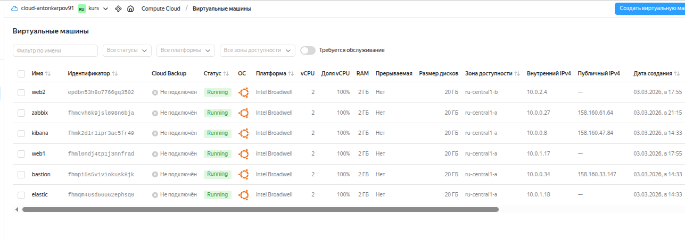
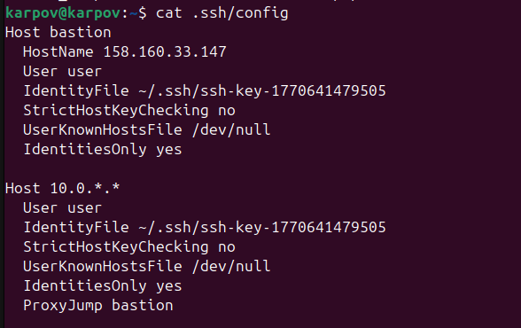
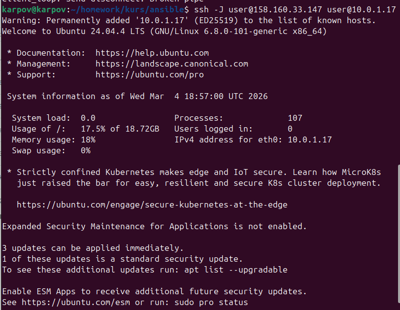
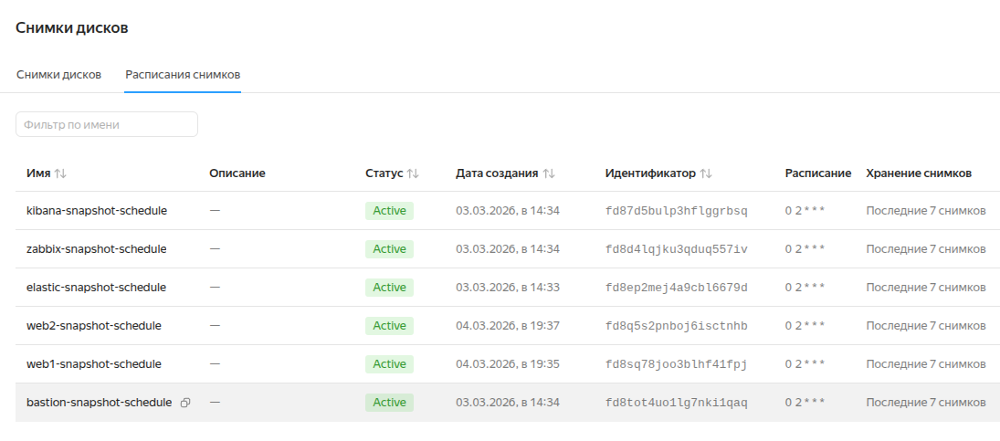
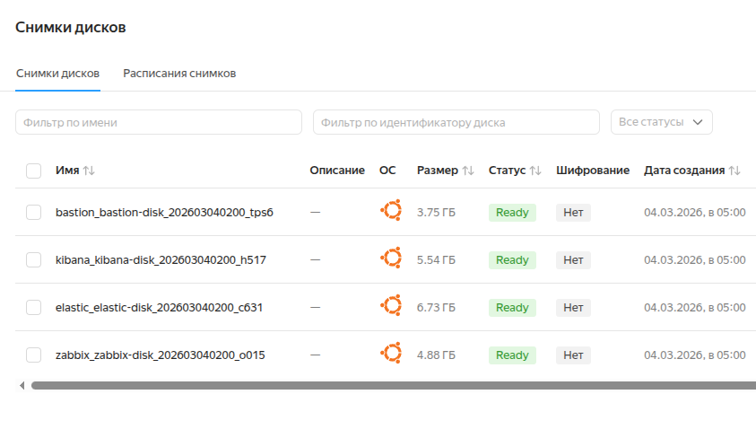

# Курсовая работа на профессии "DevOps-инженер с нуля". Карпов Антон 

## Задача
Ключевая задача — разработать отказоустойчивую инфраструктуру для сайта, включающую мониторинг, сбор логов и резервное копирование основных данных. Инфраструктура должна размещаться в Yandex Cloud.

## Инфраструктура

Для развёртывания инфраструктуры использованы Terraform и Ansible.

Публичные ресурсы для проверки:

Веб-сайт:
http://158.160.217.48/

Zabbix:
http://158.160.61.64/zabbix
Данные для входа отправлены в комментарии при отправке работы.

Kibana:
http://158.160.47.84:5601/


Созданные в результате ВМ:




### Сайт

**С помощью Terraform ([web-servers.tf](terraform/web-servers.tf)) были созданы:**

- 2 ВМ с одинаковым содержимым и в разных зонах
- Target Group, Backend Group, HTTP Router
- Application Load Balancer 

**С помощью Ansible ([web.yaml](ansible/web.yaml)):**

- установлен, настроен и запущен Nginx
- Git
- содержимое веб-сайта склонировано на каждый веб-сервер с github

**Итог:**

- публичный адрес балансировщика: http://158.160.217.48/
- изменения для сайта можно клонировать с github с помощью ansible, для удобства можно создать отдельный playbook для этого. 

Сама схема обновления хоть и имеет неудобства (необходимость вносить изменения сразу на 2 веб-сервера), но зато более отказоустойчива, т.к. оба сервера работают независимо друг от друга. В целом, для статичного сайта с нечастым обновлением подойдет. Если же необходим будет динамический сайт, имеющий еще и базу данных, и CMS, эта схема будет неуместной без дополнитнльной автоматизации.

### Мониторинг

**Terraform:**

- развернута ВМ zabbix для сервера ([zabbix.tf](terraform/zabbix.tf))

**Ansible:**

- настроен Zabbix: сервер, фронт, БД ([zabbix-server.yaml](ansible/zabbix-server.yaml))
- установлены и настроены агенты на всех ВМ ([zabbix-agent.yaml](ansible/zabbix-agent.yaml))

**Другие настройки:**

Настроен дашборд Web dashboard с основными метриками: утилизация и Average ЦПУ, свободный объем ОЗУ и SWAP, свободное место и скорость чтения/записи на дисках, а также скорость передачи данных по сети. Кроме того, настроены веб-сценарии для доступности работы сайта на каждом веб-сервере. 

Не настроил tresholds. Причина - установил Zabbix слишком старой версии (6.0.44), и нигде не смог найти этих настроек. Ввиду ограниченности времени, оставил пока так. Если критично - буду пытаться обновлять. 

Адрес входа в веб-интерфейс Zabbix: http://158.160.61.64/zabbix
Данные для входа отправлены в комментарии при отправке работы.

### Логи

**Terraform:**

- развернута ВМ для Elasticsearch ([elastic.tf](terraform/elastic.tf))
- развернута ВМ для Kibana ([kibana.tf](terraform/kibana.tf))

**Ansible:**

- установка Elasticsearch в Docker-контейнере ([elastic.yaml](ansible/elastic.yaml))
- установка Kibana и настройка в Docker-контейнере ([kibana.yaml)](ansible/kibana.yaml))
- установка и настройка Filebeat на веб-серверах в Docker-контейнерах ([filebeat.yaml](ansible/filebeat.yaml))

Настроено получение access.log, error.log nginx в Elasticsearch 

Доступ к Kibana: http://158.160.47.84:5601/

### Сеть

**Terraform**:

- создана сеть main-network ([network.tf](terraform/network.tf)), в ней 2 приватные подсети: subnet-a, subnet-b и публичная public.  

Сервера web, Elasticsearch помещены в приватные подсети. Сервера Zabbix, Kibana, application load balancer определены в публичную подсеть.


- созданы Security groups ([security.tf](terraform/security.tf)) сервисов на входящий трафик только к нужным портам.

Настроена ВМ bastion c публичным IP http://158.160.33.147 с открытым портом SSH. 
Настройка .ssh/config:



Подключение выполняется следующим образом (например, к web1):

```
ssh -J user@158.160.33.147 user@10.0.1.17
```



### Резервное копирование

**Terraform:**

Настроен ежедневный снапшот дисков каждой ВМ в 02:00, хранение 7 дней ([snapshots.tf](terraform/snapshots.tf)):



Результаты их выполнения (веб-сервера добавлены позже, сначала этот момент упустил из-за неудачных экспериментов с instance group):



### Итог

Вся работа выполнялась путем множества проб и ошибок, поэтому недостаточно "отополирована" и оптимизирована (те же tresholds в Zabbix) из-за нехватки времени. Если есть еще моменты, которые нужно доработать или уточнить, пожалуйста, укажите.  